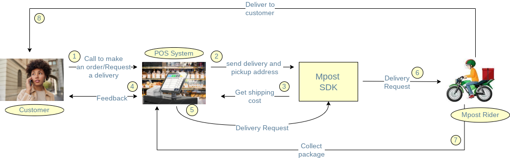

# Mpost Flutter Library

This SDK aims to help the development of integrations with
[Mpost](https://mpost.co.ke/) that use Dart, providing an easy
interface to communicate with
[Mpost's REST API](https://mpost.co.ke/). It's multi-platform, and supports mobile, desktop, and the browser.

## Usage

You can keep open a persistent connection by using a [Mpost] Object initialised with your [api-key]

```js
import 'package:mpost/models/distance.dart';
import 'package:mpost/models/distanceRequest.dart';
import 'package:mpost/models/place.dart';
import 'package:mpost/mpost.dart'

final mpost = Mpost("YOUR-API-KEY");

//calculateDistance
Place pickUpAddress = Place(latitude: -0.9534506, longitude: 37.0820681);
Place deliveryAddress = Place(latitude: -1.046594, longitude: 37.060197);

DistanceRequest distanceRequest = DistanceRequest(
        delivery_address: deliveryAddress, pickup_address: pickUpAddress);

Distance distance = await mpost.calculateDistance(distanceRequest);

//createDeliveryRequest
DeliveryRequest deliveryRequest = await mpost.createDeliveryRequest(newDeliveryRequest);

```
## Available methods
- `getDeliveryRequests(queryObject)`
- `getDeliveryRequestById(queryObject)`
- `createDeliveryRequest(queryObject)`
- `calculateDistance(queryObject)`

## Creating Delivery Request Case Study
