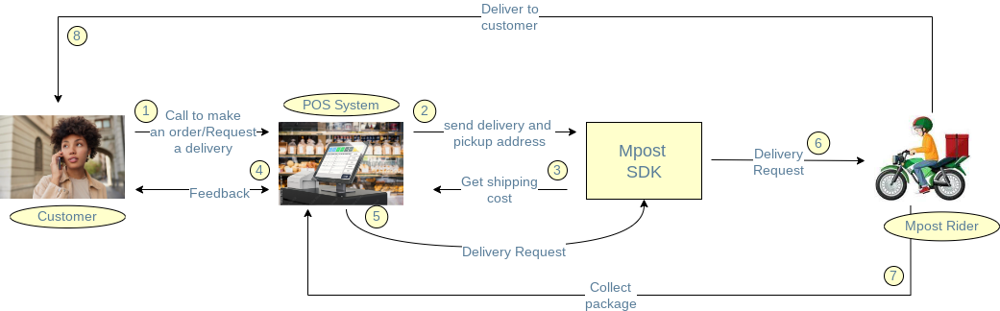

# Mpost Flutter Library

This SDK aims to help the development of integrations with
[Mpost](https://mpost.co.ke/) that use Dart, providing an easy
interface to communicate with
[Mpost's REST API](https://mpost.co.ke/). It's multi-platform, and supports mobile, desktop, and the browser.

## Usage

You can keep open a persistent connection by using a [Mpost] Object initialised with your [api-key]

```js
import 'package:mpost/models/distance.dart';
import 'package:mpost/models/distanceRequest.dart';
import 'package:mpost/models/place.dart';
import 'package:mpost/mpost.dart'

final mpost = Mpost("YOUR-API-KEY");

//calculateDistance
Place pickUpAddress = Place(latitude: -0.9534506, longitude: 37.0820681);
Place deliveryAddress = Place(latitude: -1.046594, longitude: 37.060197);

DistanceRequest distanceRequest = DistanceRequest(
        delivery_address: deliveryAddress, pickup_address: pickUpAddress);

Distance distance = await mpost.calculateDistance(distanceRequest);

//createDeliveryRequest
Address deliveryAddress = Address(
        latitude: 40.659569,
        longitude: -73.933783,
        address: "Globe Round About",
        detailed_address:
            "Sunrays House, Near Globe Cinema Roundabout, Nairobi City");

Address pickupAddress = Address(
        latitude: 37.785834,
        longitude: -122.406417,
        address: "Globe Round About",
        detailed_address:
            "Sunrays House, Near Globe Cinema Roundabout, Nairobi City");

NewDeliveryRequest newDeliveryRequest = NewDeliveryRequest(
      delivery_address: deliveryAddress,
      item_type: 'Food',
      pickup_time: '2022-02-02 11:11:00',
      pickup_address: pickupAddress,
      recipient_mobile: '0712695820',
      recipient_name: 'Elias Baya',
    );

DeliveryRequest deliveryRequest = await mpost.createDeliveryRequest(newDeliveryRequest);


//Get All Delivery Requests
List<DeliveryRequest> deliveryRequests = await mpost.getDeliveryRequests();

//Get A Single Delivery Request
DeliveryRequest deliveryRequest = await await mpost.getDeliveryRequest(130);
```

## Available methods
- `getDeliveryRequests()`
- `getDeliveryRequestById(int)`
- `createDeliveryRequest(queryObject)`
- `calculateDistance(queryObject)`

## Creating Delivery Request Case Study
